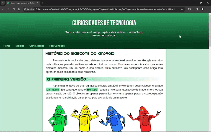

# CursoemVideo - Desafio Site Android

Essa é a minha versão do desafio 10 do [CursoemVideo](https://www.youtube.com/watch?v=Ejkb_YpuHWs&list=PLHz_AreHm4dkZ9-atkcmcBaMZdmLHft8n) sobre montar um site responsivo.

## Proposta do desafio:

Utilizar o conhecimento obtido no módulo 2 do curso de HTML e CSS para criar um site responsivo para telas de diversos tamanhos.

